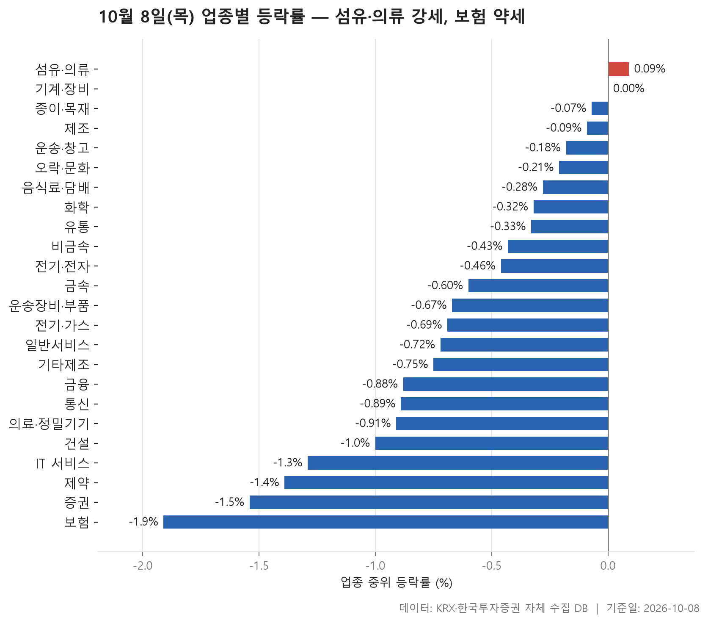
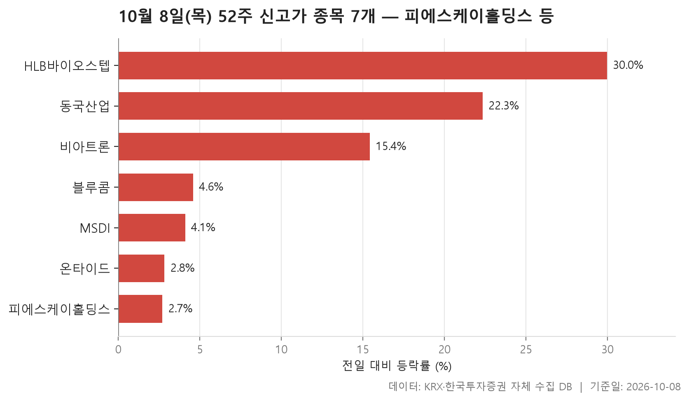
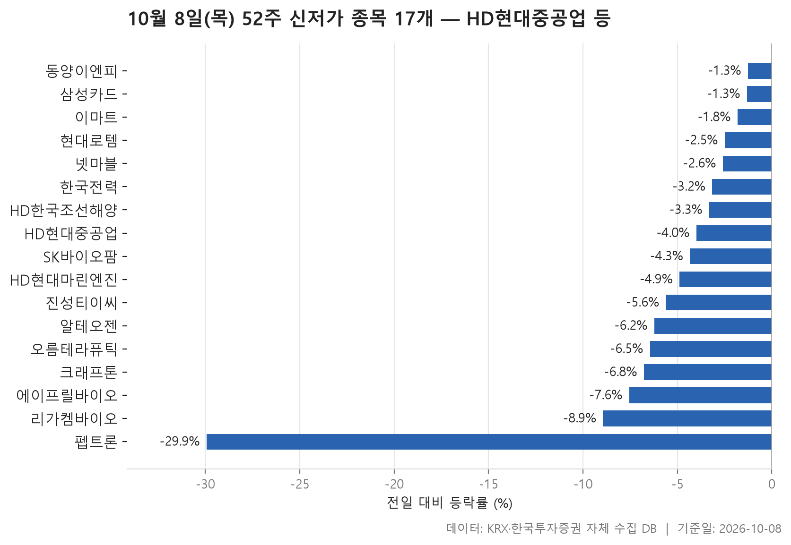
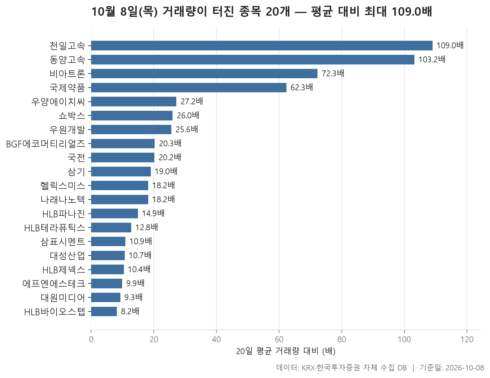

10월 8일 시장을 업종 단위로 보면 거의 모든 업종이 아래를 향했습니다. 24개 업종 가운데 중위 등락률이 플러스로 끝난 곳은 1개, 마이너스로 끝난 곳은 22개입니다. 업종별 중위 등락률을 한 줄로 세웠을 때 한가운데 놓인 값은 -0.64%였습니다. 제목에는 '섬유·의류 강세'라고 적었지만 그 업종의 중위 등락률도 +0.09%에 그칩니다. 강하게 올랐다기보다 덜 빠졌다고 읽는 편이 정확합니다.

종목 단위로 내려가면 모습이 조금 다릅니다. 여러 업종에 +30.00% 가까이 뛴 종목이 하나씩 끼어 있어서 평균과 중위값이 따로 노는 업종이 많았습니다. 거래량이 평소의 수십 배로 불어난 종목도 적지 않았습니다. 52주 신고가는 7개, 신저가는 17개로 신저가가 더 많았고, 신저가 명단에는 시가총액이 큰 대형주가 여럿 올라 있습니다.

업종 흐름, 신고가, 신저가, 거래량 급증 순서로 보겠습니다. 표만 봐서는 놓치기 쉬운 어긋난 대목을 중심으로 짚었습니다.

> 기준일: 2026-10-08 · 집계: 자체 수집 데이터베이스

## 업종 등락률 — 24개 중 22개 하락

순위를 중위값으로 매겼기 때문에 맨 위의 섬유·의류도 +0.09%로 사실상 보합입니다. 바로 아래 기계·장비는 0.00%로 제자리였고, 그 밑으로는 모두 마이너스입니다. 섬유·의류는 46개 종목 중 52.20%가 올라 오른 종목이 절반을 조금 넘었습니다. 표에서 오른 종목이 과반인 업종은 이곳 하나뿐입니다.

먼저 볼 것은 중위값과 평균이 벌어진 업종입니다. 운송·창고는 중위 등락률이 -0.18%인데 평균은 +1.49%로 플러스입니다. 동양고속이 +29.91% 오르면서 이 종목 하나가 업종 평균을 1.07%p 끌어올린 영향이 큽니다. 섬유·의류의 평균 +1.07%에서도 형지I&C(+30.00%) 한 종목이 0.65%p를 차지했고, 오락·문화에서는 빅텐츠(+29.84%)가 0.47%p를 더했습니다. 평균만 보면 오른 날 같지만 가운데 있는 종목들은 약보합이었던 업종들입니다. 종이·목재는 그 반대입니다. 중위값은 -0.07%로 상위권인데 평균은 -1.20%까지 내려갔습니다. 블루산업개발이 -22.25% 떨어지면서 평균을 -0.89%p 끌어내렸기 때문입니다.

하위권에는 금융 쪽 업종이 몰려 있습니다. 보험이 -1.91%로 가장 약했고 증권이 -1.54%, 금융이 -0.88%입니다. 증권은 18개 종목 가운데 오른 곳이 한 곳도 없었고(0.00%), 보험은 11개 중 9.10%만 올랐으니 한 곳 정도입니다. 보험에서 가장 크게 움직인 종목은 미래에셋생명(-9.93%)이었습니다. 제약(-1.39%)은 오른 종목이 여섯 중 하나꼴, IT 서비스(-1.29%)는 다섯 중 하나꼴에 머물렀습니다.

거래대금은 전기·전자가 159,712.90억원으로 다른 업종을 크게 앞섭니다. 이 업종의 중위 등락률은 -0.46%로, 24개 업종의 한가운데 값인 -0.64%보다 조금 나은 편이었습니다.

| 업종 | 종목수(개) | 중위등락률(%) | 평균등락률(%) | 상승비율(%) | 주도종목 | 주도종목등락률(%) | 평균기여도(%p) | 거래대금합계(억원) |
|---|---|---|---|---|---|---|---|---|
| 섬유·의류 | 46 | +0.09 | +1.07 | 52.20 | 형지I&C | +30.00 | 0.65 | 196.10 |
| 기계·장비 | 205 | 0.00 | +0.37 | 49.30 | 다원넥스뷰 | +17.46 | 0.09 | 35,266.10 |
| 종이·목재 | 25 | -0.07 | -1.20 | 36.00 | 블루산업개발 | -22.25 | -0.89 | 38.70 |
| 제조 | 8 | -0.09 | +0.17 | 37.50 | 이월드 | -4.42 | -0.55 | 8.90 |
| 운송·창고 | 28 | -0.18 | +1.49 | 42.90 | 동양고속 | +29.91 | 1.07 | 2,777.60 |
| 오락·문화 | 64 | -0.21 | +0.93 | 39.10 | 빅텐츠 | +29.84 | 0.47 | 925.10 |
| 음식료·담배 | 83 | -0.28 | -0.60 | 26.50 | 한탑 | -8.03 | -0.10 | 1,209.80 |
| 화학 | 221 | -0.32 | -0.24 | 36.70 | 예선테크 | +29.90 | 0.14 | 12,082.60 |
| 유통 | 159 | -0.33 | +0.25 | 37.10 | 형지글로벌 | +29.88 | 0.19 | 5,100.30 |
| 비금속 | 35 | -0.43 | -0.46 | 28.60 | 삼표시멘트 | -9.46 | -0.27 | 1,433.50 |
| 전기·전자 | 364 | -0.46 | -0.13 | 37.10 | CS | +29.97 | 0.08 | 159,712.90 |
| 금속 | 130 | -0.60 | -0.11 | 34.60 | 유진테크놀로지 | +30.00 | 0.23 | 6,848.50 |
| 운송장비·부품 | 134 | -0.67 | -0.77 | 34.30 | 뉴인텍 | +29.95 | 0.22 | 16,272.10 |
| 전기·가스 | 10 | -0.69 | -1.14 | 20.00 | SGC에너지 | -3.37 | -0.34 | 552.00 |
| 일반서비스 | 167 | -0.72 | -0.61 | 31.70 | HLB바이오스텝 | +29.97 | 0.18 | 8,973.00 |
| 기타제조 | 14 | -0.75 | -0.11 | 28.60 | 엑스플러스 | +7.16 | 0.51 | 28.50 |
| 금융 | 111 | -0.88 | -1.13 | 22.50 | SK스퀘어 | -8.06 | -0.07 | 23,814.60 |
| 통신 | 13 | -0.89 | -1.26 | 23.10 | 프리티 | -4.18 | -0.32 | 946.00 |
| 의료·정밀기기 | 101 | -0.91 | -0.99 | 35.60 | 큐리옥스바이오시스템즈 | -9.63 | -0.10 | 2,135.80 |
| 건설 | 51 | -1.00 | -1.30 | 17.60 | 엑사이엔씨 | +7.50 | 0.15 | 3,050.00 |
| IT 서비스 | 245 | -1.29 | -1.55 | 22.00 | 모아데이타 | +29.56 | 0.12 | 8,414.40 |
| 제약 | 166 | -1.39 | -1.76 | 16.30 | HLB파나진 | +29.96 | 0.18 | 9,590.50 |
| 증권 | 18 | -1.54 | -1.97 | 0.00 | NH투자증권 | -6.59 | -0.37 | 1,416.10 |
| 보험 | 11 | -1.91 | -2.18 | 9.10 | 미래에셋생명 | -9.93 | -0.90 | 2,373.20 |

## 52주 신고가 7개 — 최고 HLB바이오스텝 29.97%

신고가 종목은 7개로 신저가의 절반에도 못 미칩니다. 시장별로는 KOSDAQ 6개, KOSPI 1개로 코스닥에 쏠려 있고, 업종으로는 기계·장비가 2개로 가장 많습니다. 7개 종목 등락률의 중위값은 +4.59%입니다.

시가총액이 가장 큰 종목은 45,173억원의 피에스케이홀딩스입니다. 그런데 이날 상승률은 +2.70%로 목록에서 가장 낮았습니다. 종가 209,500원은 이전 52주 최고가 208,500원을 조금 넘긴 수준이어서, 큰 폭으로 뛰었다기보다 고점 바로 밑에 있다가 살짝 넘어선 쪽에 가깝습니다. 반면 HLB바이오스텝(+29.97%), 동국산업(+22.34%), 비아트론(+15.43%)은 하루에 크게 오르면서 고점을 넘었습니다. 이 가운데 HLB바이오스텝과 비아트론은 뒤의 거래량 급증 표에 다시 나옵니다.

거래대금도 같이 보는 것이 좋습니다. 블루콤은 3.00억원, 온타이드는 5.20억원으로 집계 기준인 3억원을 간신히 넘겼습니다. 거래가 얇은 날 나온 신고가라는 점을 함께 기억해 둘 만합니다.

| 종목명 | 종목코드 | 시장 | 업종 | 종가(원) | 등락률(%) | 이전52주최고(원) | 거래대금(억원) | 시가총액(억원) |
|---|---|---|---|---|---|---|---|---|
| 피에스케이홀딩스 | 031980 | KOSDAQ | 기계·장비 | 209,500 | +2.70 | 208,500 | 456.20 | 45,173 |
| 동국산업 | 005160 | KOSDAQ | 금속 | 4,710 | +22.34 | 4,485 | 946.00 | 2,555 |
| 비아트론 | 141000 | KOSDAQ | 기계·장비 | 13,840 | +15.43 | 12,890 | 596.80 | 1,677 |
| HLB바이오스텝 | 278650 | KOSDAQ | 일반서비스 | 6,310 | +29.97 | 5,800 | 328.40 | 1,100 |
| 블루콤 | 033560 | KOSDAQ | 전기·전자 | 5,920 | +4.59 | 5,720 | 3.00 | 1,012 |
| MSDI | 123010 | KOSDAQ | 전기·전자 | 4,825 | +4.10 | 4,690 | 22.30 | 975 |
| 온타이드 | 005320 | KOSPI | 유통 | 1,600 | +2.83 | 1,557 | 5.20 | 547 |

## 52주 신저가 17개 — 최저 펩트론 -29.94%

신저가는 17개이고 KOSPI 10개, KOSDAQ 7개입니다. 코스닥에 몰린 신고가와 달리 코스피 비중이 큽니다. 무엇보다 종목들의 덩치가 큽니다. 시가총액 403,051억원의 HD현대중공업이 -4.00% 내려 이전 52주 최저가 399,500원 아래로 떨어졌습니다. HD한국조선해양(-3.32%), HD현대마린엔진(-4.89%), 현대로템(-2.50%)도 나란히 명단에 올랐고, 한국전력(-3.16%)도 들어 있습니다. HD한국조선해양은 저희 분류에서 금융 업종으로 잡혀 있다는 점도 참고해 주세요.

업종별로는 일반서비스가 4개로 가장 많은데, 알테오젠(-6.23%), SK바이오팜(-4.34%), 리가켐바이오(-8.94%), 에이프릴바이오(-7.56%)로 모두 바이오 종목입니다. 제약으로 분류된 펩트론과 오름테라퓨틱까지 더하면 신저가 명단에서 바이오·제약 쪽 비중이 상당합니다. 첫 번째 표에서 제약 업종이 하위권이었던 것과 같은 방향입니다.

하락 폭은 종목마다 크게 달랐습니다. 펩트론은 -29.94% 급락해 91,500원에 마감하면서 이전 최저가 98,000원을 크게 밑돌았습니다. 반면 동양이엔피(-1.27%)나 삼성카드(-1.32%)는 조금만 내리고도 신저가가 됐습니다. 원래 저점 바로 위에서 거래되고 있었다는 뜻입니다. 17개 종목 등락률의 중위값은 -4.34%입니다.

| 종목명 | 종목코드 | 시장 | 업종 | 종가(원) | 등락률(%) | 이전52주최저(원) | 거래대금(억원) | 시가총액(억원) |
|---|---|---|---|---|---|---|---|---|
| HD현대중공업 | 329180 | KOSPI | 운송장비·부품 | 384,000 | -4.00 | 399,500 | 1,255.20 | 403,051 |
| HD한국조선해양 | 009540 | KOSPI | 금융 | 291,500 | -3.32 | 300,000 | 979.60 | 206,304 |
| 한국전력 | 015760 | KOSPI | 전기·가스 | 29,100 | -3.16 | 29,800 | 440.70 | 186,812 |
| 알테오젠 | 196170 | KOSDAQ | 일반서비스 | 241,000 | -6.23 | 244,000 | 1,698.40 | 167,869 |
| 현대로템 | 064350 | KOSPI | 운송장비·부품 | 105,200 | -2.50 | 107,600 | 671.20 | 114,818 |
| 크래프톤 | 259960 | KOSPI | IT 서비스 | 186,900 | -6.78 | 194,300 | 331.10 | 85,817 |
| SK바이오팜 | 326030 | KOSPI | 일반서비스 | 72,700 | -4.34 | 73,000 | 109.70 | 56,934 |
| 삼성카드 | 029780 | KOSPI | 금융 | 41,200 | -1.32 | 41,550 | 28.70 | 47,734 |
| 넷마블 | 251270 | KOSPI | IT 서비스 | 33,650 | -2.60 | 33,800 | 55.10 | 27,983 |
| 리가켐바이오 | 141080 | KOSDAQ | 일반서비스 | 73,300 | -8.94 | 76,900 | 282.70 | 27,135 |
| 펩트론 | 087010 | KOSDAQ | 제약 | 91,500 | -29.94 | 98,000 | 562.60 | 21,335 |
| 이마트 | 139480 | KOSPI | 유통 | 70,000 | -1.82 | 70,300 | 81.50 | 19,317 |
| HD현대마린엔진 | 071970 | KOSPI | 기계·장비 | 42,800 | -4.89 | 44,800 | 109.20 | 14,518 |
| 오름테라퓨틱 | 475830 | KOSDAQ | 제약 | 19,270 | -6.46 | 20,150 | 58.70 | 4,192 |
| 에이프릴바이오 | 397030 | KOSDAQ | 일반서비스 | 14,560 | -7.56 | 15,750 | 55.00 | 4,013 |
| 진성티이씨 | 036890 | KOSDAQ | 기계·장비 | 10,600 | -5.61 | 11,180 | 12.50 | 2,335 |
| 동양이엔피 | 079960 | KOSDAQ | 전기·전자 | 16,370 | -1.27 | 16,570 | 4.60 | 1,236 |

## 거래량 급증 20개 — 최고 천일고속 109배

거래량 급증 표의 맨 위 두 종목은 업종이 같습니다. 천일고속은 거래량이 20일 평균의 109배, 동양고속은 103.20배였고 둘 다 운송·창고입니다. 등락률도 +22.57%, +29.91%로 나란히 크게 올랐습니다. 첫 번째 표에서 운송·창고의 평균이 중위값과 크게 벌어졌던 것과 같은 날 일어난 일입니다. 천일고속은 평소 하루 거래량이 2,246주에 불과했던 종목이라 배수가 특히 크게 나왔습니다.

HLB라는 이름을 단 종목도 여럿 보입니다. HLB파나진(+29.96%), HLB바이오스텝(+29.97%), HLB제넥스(+20.00%), HLB테라퓨틱스(+8.36%)가 모두 평소보다 훨씬 많이 거래되면서 올랐습니다. 왜 함께 움직였는지는 자료에 없고, 같은 날 같은 방향으로 움직였다는 것만 확인됩니다. 업종으로는 제약이 4개로 가장 많고, 시장으로는 KOSDAQ이 16개로 대부분을 차지합니다.

거래량이 늘었다고 모두 오른 것은 아닙니다. 국제약품(-3.61%), 우양에이치씨(-4.06%), 삼표시멘트(-9.46%), 대성산업(-7.80%)은 거래가 몰린 가운데 내렸습니다. 국제약품은 20,717,282주가 거래돼 평소의 62.30배였습니다. 표에서 시가총액이 가장 큰 삼표시멘트(7,640억원)는 10.90배 거래 속에 밀리면서 비금속 업종에서 가장 크게 움직인 종목이 됐습니다. 20개 종목의 배수 중위값은 18.60배입니다.

| 종목명 | 종목코드 | 시장 | 업종 | 종가(원) | 등락률(%) | 거래량(주) | 평균거래량(주) | 배수(배) | 거래대금(억원) | 시가총액(억원) |
|---|---|---|---|---|---|---|---|---|---|---|
| 천일고속 | 000650 | KOSPI | 운송·창고 | 221,000 | +22.57 | 244,773 | 2,246 | 109.00 | 531.50 | 3,159 |
| 동양고속 | 084670 | KOSPI | 운송·창고 | 38,000 | +29.91 | 1,392,409 | 13,495 | 103.20 | 508.50 | 1,100 |
| 비아트론 | 141000 | KOSDAQ | 기계·장비 | 13,840 | +15.43 | 4,259,968 | 58,915 | 72.30 | 596.80 | 1,677 |
| 국제약품 | 002720 | KOSPI | 제약 | 4,270 | -3.61 | 20,717,282 | 332,612 | 62.30 | 938.40 | 904 |
| 우양에이치씨 | 101970 | KOSDAQ | 금속 | 9,680 | -4.06 | 134,208 | 4,941 | 27.20 | 14.80 | 1,432 |
| 쇼박스 | 086980 | KOSDAQ | 오락·문화 | 1,982 | +14.97 | 1,808,915 | 69,672 | 26.00 | 35.00 | 1,238 |
| 우원개발 | 046940 | KOSDAQ | 건설 | 2,835 | +3.28 | 1,660,866 | 64,854 | 25.60 | 49.50 | 512 |
| BGF에코머티리얼즈 | 126600 | KOSDAQ | 화학 | 3,680 | +12.20 | 1,220,631 | 60,010 | 20.30 | 44.60 | 2,310 |
| 국전 | 307750 | KOSDAQ | 제약 | 2,975 | +7.40 | 17,172,015 | 850,423 | 20.20 | 522.10 | 1,606 |
| 삼기 | 122350 | KOSDAQ | 운송장비·부품 | 1,720 | +7.17 | 20,030,767 | 1,053,821 | 19.00 | 369.50 | 659 |
| 헬릭스미스 | 084990 | KOSDAQ | 일반서비스 | 4,530 | +14.83 | 4,086,490 | 224,269 | 18.20 | 190.30 | 2,088 |
| 나래나노텍 | 137080 | KOSDAQ | 기계·장비 | 6,800 | +12.21 | 140,076 | 7,680 | 18.20 | 9.70 | 728 |
| HLB파나진 | 046210 | KOSDAQ | 제약 | 1,774 | +29.96 | 6,709,894 | 451,646 | 14.90 | 112.80 | 808 |
| HLB테라퓨틱스 | 115450 | KOSDAQ | 유통 | 3,175 | +8.36 | 8,966,129 | 701,558 | 12.80 | 296.10 | 3,006 |
| 삼표시멘트 | 038500 | KOSDAQ | 비금속 | 7,080 | -9.46 | 12,744,009 | 1,170,643 | 10.90 | 986.60 | 7,640 |
| 대성산업 | 128820 | KOSPI | 유통 | 4,610 | -7.80 | 4,827,120 | 452,659 | 10.70 | 233.40 | 2,085 |
| HLB제넥스 | 187420 | KOSDAQ | 제약 | 2,610 | +20.00 | 4,174,212 | 401,553 | 10.40 | 108.90 | 852 |
| 에프엔에스테크 | 083500 | KOSDAQ | 기계·장비 | 17,080 | +15.64 | 634,777 | 64,204 | 9.90 | 105.00 | 1,419 |
| 대원미디어 | 048910 | KOSDAQ | 유통 | 8,250 | +11.94 | 495,825 | 53,442 | 9.30 | 39.50 | 1,038 |
| HLB바이오스텝 | 278650 | KOSDAQ | 일반서비스 | 6,310 | +29.97 | 5,605,492 | 682,979 | 8.20 | 328.40 | 1,100 |

## 정리

10월 8일을 한 문장으로 줄이면, 대부분의 업종이 조금씩 밀린 가운데 몇몇 종목만 크게 뛰어 업종 평균을 끌어올렸고, 대형주 일부와 바이오 종목들은 52주 저점을 새로 쓴 하루였습니다. 업종 순위만 보면 고르게 약한 날이지만, 평균과 중위값의 차이, 거래량 배수를 함께 보면 움직임이 일부 종목에 몰려 있었다는 것이 드러납니다.

몇 가지 한계도 적어 둡니다. 이 글은 하루치 종가만 비교한 것이어서 추세를 말해 주지는 않습니다. 업종 분류는 저희 데이터베이스 기준이라 일반적인 분류와 다를 수 있습니다. 종목이 왜 오르거나 내렸는지는 자료에 없으므로 따로 해석하지 않았습니다. 이 글은 특정 종목을 사거나 팔라는 권유가 아닙니다.

## 집계 기준

**업종 등락률**

- **기준**: 2026-10-07 종가 → 2026-10-08 종가
- **순위**: 업종 내 종목 등락률의 중위값 (평균은 참고용으로 함께 표시)
- **주도종목**: 그 업종에서 등락률 절대값이 가장 큰 종목 (동점이면 거래대금이 큰 쪽)
- **평균기여도**: 그 종목 하나가 업종 평균을 움직인 폭 (등락률 ÷ 종목수). 중위값과 평균의 격차가 이 값에 가까우면 평균을 만든 것이 그 종목이고, 훨씬 크면 다른 종목들도 함께 움직인 것입니다
- **필터**: 업종 내 보통주 5종목 이상
- **전체업종중위등락률(%)**: -0.64

**52주 신고가**

- **기준**: 종가 > 직전 52주 최고가
- **관측구간**: 2025-09-22 ~ 2026-10-07 (252거래일)
- **필터**: 시가총액 500억 이상, 거래대금 3억 이상, 보통주

**52주 신저가**

- **기준**: 종가 < 직전 52주 최저가
- **관측구간**: 2025-09-22 ~ 2026-10-07 (252거래일)
- **필터**: 시가총액 500억 이상, 거래대금 3억 이상, 보통주

**거래량 급증**

- **기준**: 당일 거래량 ≥ 직전 20거래일 평균 × 5
- **관측구간**: 2026-09-07 ~ 2026-10-07 (20거래일)
- **필터**: 시가총액 500억 이상, 거래대금 3억 이상, 보통주

## 데이터 출처 및 유의사항

- **데이터출처**: 한국거래소(KRX) 공시 데이터와 한국투자증권 OpenAPI 를 직접 수집해 구축한 자체 데이터베이스
- **집계방식**: 수집·집계·차트 생성을 직접 구현한 파이프라인에서 자동 산출
- **작성고지**: 본문의 표·통계·차트는 자체 데이터베이스에서 계산된 값이며, 문장 작성 과정에 AI 도구를 활용했습니다.
- **면책**: 본 글은 정보 제공을 목적으로 하며 특정 종목의 매수·매도를 추천하지 않습니다. 제시된 수치는 과거 데이터이고 미래 수익을 보장하지 않습니다. 투자 판단과 그 결과에 대한 책임은 투자자 본인에게 있습니다.

