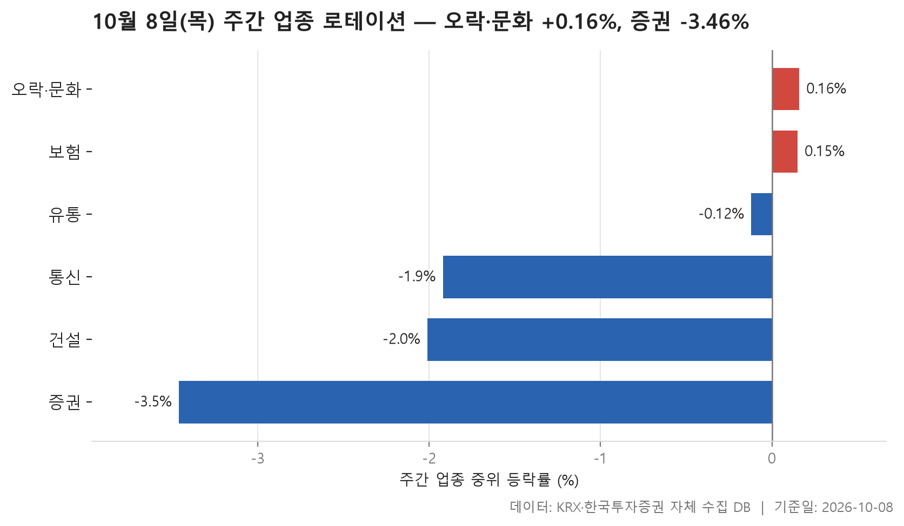
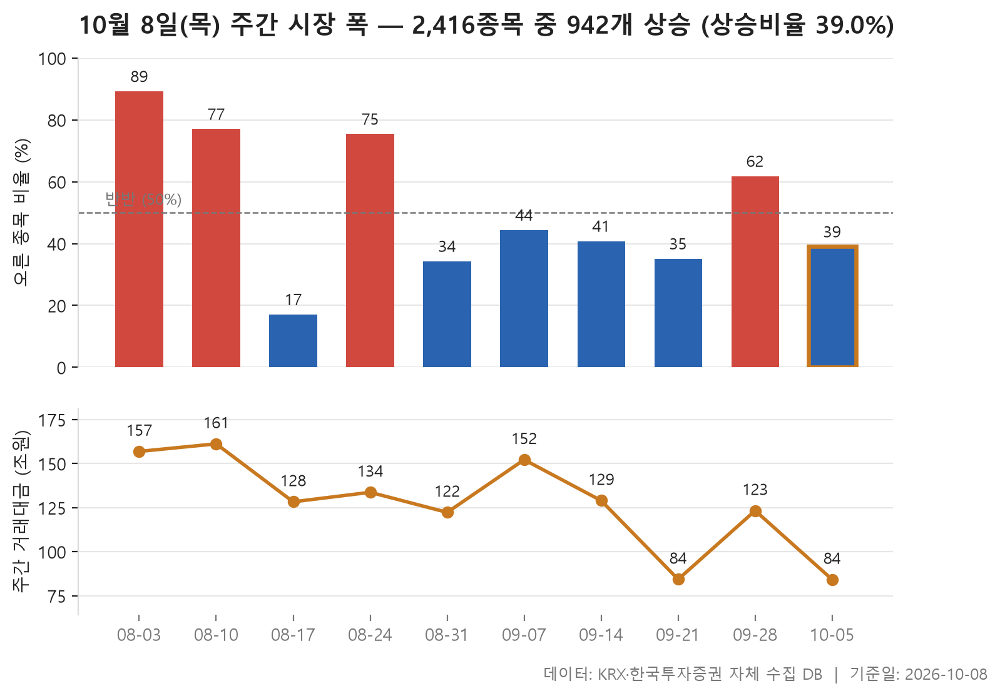
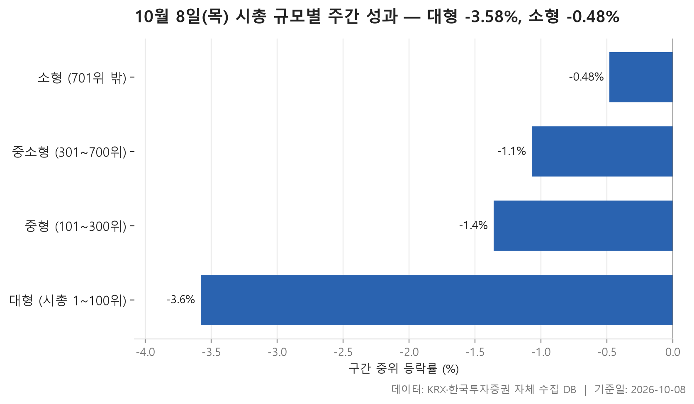

이번 주는 거래일이 사흘뿐인 짧은 한 주였습니다. 10월 2일 종가를 출발선으로 놓고 10월 8일 종가까지 무엇이 움직였는지를 세 갈래로 나눠 봅니다. 업종별로 어디가 버티고 어디가 밀렸는지, 오른 종목과 내린 종목의 수가 어떻게 갈렸는지, 그리고 시가총액이 큰 종목과 작은 종목 가운데 어느 쪽이 나았는지입니다.

결론부터 말하면 약세 쪽으로 기운 주간이었습니다. 24개 업종을 중위 등락률로 줄 세웠을 때 맨 위에 선 오락·문화가 **+0.16%**였습니다. 1등조차 겨우 플러스를 지킨 셈이죠. 맨 아래는 증권으로 **-3.46%**였습니다. 시장 전체로 봐도 오른 종목은 942개, 내린 종목은 1,435개로 내린 쪽이 더 많았습니다.

시가총액 구간으로 나눠 보면 그림이 조금 더 선명해집니다. 네 구간 모두 중위값이 마이너스였지만, 큰 종목일수록 더 많이 빠졌습니다. "소형주가 앞섰다"는 말은 이번 주에는 덜 빠졌다는 뜻으로 읽어야 합니다.

> 기준일: 2026-10-08 · 집계: 자체 수집 데이터베이스

## 주간 업종 로테이션 — 6개 중 4개 하락

위쪽 세 업종부터 보면 오락·문화(+0.16%)와 보험(+0.15%)이 거의 같은 높이에 있고, 세 번째인 유통은 이미 -0.12%로 내려와 있습니다. 상위 3개 가운데 세 번째가 마이너스라는 건, 24개 업종 중 중위값이 플러스인 곳이 이 두 업종뿐이었다는 뜻입니다. 강한 업종이 시장을 끌고 간 주간이라기보다는, 덜 밀린 업종이 위에 남은 주간에 가깝습니다.

상위 업종 안을 들여다보면 중위값과 평균이 엇갈리는 모습이 눈에 띕니다. 오락·문화는 중위값이 +0.16%인데 평균은 **+2.52%**로 훌쩍 높습니다. 한 주 동안 +39.09% 오른 아티스트스튜디오 하나가 업종 평균을 0.61%p 끌어올렸고, 그 밖에도 크게 오른 종목 몇몇이 평균을 당겼을 가능성이 있습니다. 오른 종목 비중은 51.60%로 절반을 겨우 넘겼습니다. 보험은 반대 방향입니다. 중위값은 플러스인데 평균은 -0.26%로, -6.92% 내린 삼성생명이 업종 평균을 0.63%p 깎아냈습니다. 11개 종목뿐인 업종이라 한 종목의 무게가 큽니다. 유통도 독특합니다. 157개 종목 가운데 한창이 -53.57%로 크게 빠졌는데도 평균은 +0.59%로 플러스입니다. 큰 하락 하나를 다른 종목들의 상승이 덮고도 남았다는 이야기죠.

아래쪽 세 업종은 사정이 다릅니다. 통신(-1.92%), 건설(-2.01%), 증권(-3.46%) 모두 중위값과 평균이 비슷한 자리에 있어, 몇몇 종목이 아니라 업종 전체가 함께 내려앉은 모양입니다. 오른 종목 비중이 통신 15.40%, 건설 17.60%로 여섯 곳 중 한 곳꼴이었고, 증권은 5.60%에 그쳐 오른 종목을 찾기 어려웠습니다. 증권에서 가장 크게 움직인 NH투자증권도 -7.98%로, 튀는 종목 하나보다는 업종 전체가 고르게 밀린 쪽으로 보입니다. 왜 이렇게 됐는지는 이 자료만으로는 알 수 없습니다.

| 업종 | 종목수(개) | 주간중위등락률(%) | 주간평균등락률(%) | 상승비율(%) | 주도종목 | 주도종목등락률(%) | 평균기여도(%p) |
|---|---|---|---|---|---|---|---|
| 오락·문화 | 64 | +0.16 | +2.52 | 51.60 | 아티스트스튜디오 | +39.09 | 0.61 |
| 보험 | 11 | +0.15 | -0.26 | 54.50 | 삼성생명 | -6.92 | -0.63 |
| 유통 | 157 | -0.12 | +0.59 | 45.90 | 한창 | -53.57 | -0.34 |
| 통신 | 13 | -1.92 | -2.36 | 15.40 | 나이스정보통신 | -5.34 | -0.41 |
| 건설 | 51 | -2.01 | -2.53 | 17.60 | 베노티앤알 | -19.37 | -0.38 |
| 증권 | 18 | -3.46 | -3.84 | 5.60 | NH투자증권 | -7.98 | -0.44 |

## 주간 시장 폭 — 10주 중 이번 주는 2,416개 중 942개 상승

이번 주에는 오른 종목이 942개, 내린 종목이 1,435개였습니다. 오른 종목 수를 내린 종목 수로 나누면 0.66배로, 열 종목 중 네 종목가량만 올랐다는 계산입니다. 최근 10주 이 값의 중위값인 0.76배보다도 낮습니다. 직전 주에 1.69배로 오른 종목이 더 많았던 흐름이 한 주 만에 뒤집혔습니다.

10주를 길게 놓고 보면 흐름이 둘로 나뉩니다. 8월 초에는 상승 쪽이 압도적이었습니다. 2026-08-03 주에는 오른 종목이 내린 종목의 8.61배였고, 거의 아홉 종목 중 여덟 종목이 올랐습니다. 이후 2026-08-17 주에 0.21배로 급반전했다가 그다음 주 3.22배로 다시 튀어 오르는 등, 한 주씩 크게 출렁였습니다. 반면 8월 말부터는 1배를 밑도는 주가 이어졌고, 그 사이 1배를 넘긴 건 2026-09-28 주 한 번뿐이었습니다. 출렁임은 줄었지만 무게중심은 하락 쪽으로 옮겨 온 모습입니다.

거래대금은 거래일 수와 함께 봐야 합니다. 이번 주 84.20조원은 숫자만 보면 작아 보이지만, 같은 사흘짜리였던 2026-09-21 주의 84.30조원과 거의 같은 수준입니다. 닷새짜리 주와 견주어 거래가 말랐다고 단정하기는 어렵습니다. 다만 10주 중 거래대금이 가장 컸던 주(2026-08-10 주, 161.20조원)가 상승 우위가 뚜렷하던 시기에 몰려 있다는 점은 기억해 둘 만합니다.

| 주 | 거래일수(일) | 종목수(개) | 상승(개) | 보합(개) | 하락(개) | 상승비율(%) | ADR(배) | 총거래대금(조원) |
|---|---|---|---|---|---|---|---|---|
| 2026-10-05 | 3 | 2,416 | 942 | 39 | 1,435 | 39.00 | 0.66 | 84.20 |
| 2026-09-28 | 5 | 2,408 | 1,488 | 41 | 879 | 61.80 | 1.69 | 123.30 |
| 2026-09-21 | 3 | 2,412 | 847 | 47 | 1,518 | 35.10 | 0.56 | 84.30 |
| 2026-09-14 | 5 | 2,406 | 982 | 31 | 1,393 | 40.80 | 0.70 | 129.00 |
| 2026-09-07 | 5 | 2,405 | 1,067 | 40 | 1,298 | 44.40 | 0.82 | 152.20 |
| 2026-08-31 | 5 | 2,400 | 823 | 34 | 1,543 | 34.30 | 0.53 | 122.30 |
| 2026-08-24 | 5 | 2,385 | 1,798 | 28 | 559 | 75.40 | 3.22 | 133.70 |
| 2026-08-17 | 4 | 2,386 | 408 | 16 | 1,962 | 17.10 | 0.21 | 128.30 |
| 2026-08-10 | 5 | 2,384 | 1,836 | 22 | 526 | 77.00 | 3.49 | 161.20 |
| 2026-08-03 | 5 | 2,394 | 2,136 | 10 | 248 | 89.20 | 8.61 | 156.90 |

## 시총 규모별 주간 성과 — 소형이 3.1%p 앞섬

시가총액 순위로 나눈 네 구간이 계단처럼 정렬돼 있습니다. 시총 1~100위 대형 구간의 중위값이 **-3.58%**로 가장 낮고, 중형 -1.36%, 중소형 -1.07%를 거쳐 701위 밖 소형 구간이 **-0.48%**로 가장 덜 빠졌습니다. 대형과 소형의 중위값 차이는 3.1%p입니다. 네 구간 모두 마이너스였으니 어느 쪽으로 돈이 몰렸다기보다는, 덩치가 클수록 낙폭이 컸다고 보는 편이 정확합니다.

오른 종목 비중도 같은 순서입니다. 대형 구간은 25.00%로 넷 중 하나꼴만 올랐고, 소형 구간은 40.50%였습니다. 대형 구간에서 가장 크게 움직인 LIG디펜스앤에어로스페이스가 -19.16%였다는 점도, 이 구간의 큰 움직임이 아래쪽이었음을 보여 줍니다.

어긋나는 대목은 소형 구간의 평균입니다. 중위값은 -0.48%인데 평균은 +0.27%로 플러스입니다. 같은 구간에서 HLB바이오스텝이 +119.48% 올랐고, 이런 급등 종목 몇이 1,716개 종목의 평균을 위로 끌어올린 것으로 보입니다. 중형의 케이씨텍(+34.78%), 중소형의 천일고속(+57.07%)처럼 작은 구간으로 갈수록 크게 오른 종목이 눈에 띕니다. 그래도 전형적인 소형주는 소폭 내렸다는 점은 중위값이 말해 줍니다. 거래대금은 여전히 대형 구간에 쏠려 57.80조원이 오갔고, 소형 구간은 종목 수가 훨씬 많은데도 6.60조원에 머물렀습니다.

| 구간 | 종목수(개) | 주간중위등락률(%) | 주간평균등락률(%) | 상승비율(%) | 주도종목 | 주도종목등락률(%) | 주간거래대금(조원) |
|---|---|---|---|---|---|---|---|
| 대형 (시총 1~100위) | 100 | -3.58 | -3.26 | 25.00 | LIG디펜스앤에어로스페이스 | -19.16 | 57.80 |
| 중형 (101~300위) | 200 | -1.36 | -0.70 | 36.00 | 케이씨텍 | +34.78 | 12.80 |
| 중소형 (301~700위) | 400 | -1.07 | -0.59 | 37.50 | 천일고속 | +57.07 | 6.80 |
| 소형 (701위 밖) | 1,716 | -0.48 | +0.27 | 40.50 | HLB바이오스텝 | +119.48 | 6.60 |

## 정리

정리하면, 이번 주는 사흘 동안 시장 전반이 밀렸고 그 하락이 대형주와 증권·건설·통신 같은 업종에서 더 깊었던 주간이었습니다. 버틴 쪽은 오락·문화와 보험, 그리고 시가총액이 작은 종목들이었지만, 이들도 '올랐다'기보다는 '덜 빠졌다'에 가깝습니다.

몇 가지 한계도 함께 적어 둡니다. 거래일이 사흘뿐이라 한두 종목의 급등락이 업종이나 구간의 평균을 크게 흔들 수 있고, 이 글이 중위값을 기준으로 삼은 이유도 그 때문입니다. 업종 표는 위아래 각 세 곳만 보여 주므로 가운데 업종의 흐름은 담겨 있지 않습니다. 무엇보다 이 자료에는 등락의 원인이 들어 있지 않습니다. 표는 어디가 얼마나 움직였는지를 보여 줄 뿐, 왜 그랬는지는 말해 주지 않습니다.

## 집계 기준

**주간 업종 로테이션**

- **기준**: 2026-10-02 종가 → 2026-10-08 종가
- **구간**: 2026-10-05 시작 주 — 직전 주 마지막 거래일 종가를 출발선으로 삼습니다
- **거래일수**: 3
- **순위**: 업종 내 종목 등락률의 중위값 (평균은 참고용으로 함께 표시)
- **선정**: 전체 24개 업종 중 상위 3개 · 하위 3개
- **주도종목**: 그 업종에서 같은 기간 등락률 절대값이 가장 큰 종목 (동점이면 거래대금이 큰 쪽)
- **평균기여도**: 그 종목 하나가 업종 평균을 움직인 폭 (등락률 ÷ 종목수)
- **필터**: 업종 내 보통주 5종목 이상

**주간 시장 폭**

- **기준**: 각 주의 마지막 거래일 종가를 직전 주 마지막 거래일 종가와 비교
- **주**: 그 주의 월요일 (달력 기준). 거래일 수는 연휴에 따라 다릅니다
- **ADR**: 상승 종목 수 ÷ 하락 종목 수. 1 이면 반반, 2 면 오른 종목이 두 배
- **총거래대금**: 그 주 거래일 전체의 거래대금 합계
- **모집단**: 거래가 있었던 보통주 (거래정지·액면 변경 종목 제외)

**시총 규모별 주간 성과**

- **기준**: 2026-10-02 종가 → 2026-10-08 종가
- **구간**: 기준일 시가총액 순위로 자릅니다 (금액으로 자르면 장이 오른 해에 전부 위 구간으로 올라가 해마다 다른 표가 됩니다)
- **순위**: 구간 내 종목 등락률의 중위값 (평균은 참고용으로 함께 표시)
- **주도종목**: 그 구간에서 같은 기간 등락률 절대값이 가장 큰 종목 (동점이면 거래대금이 큰 쪽)
- **대형소형격차**: -3.1
- **모집단**: 거래가 있었던 보통주 (거래정지·액면 변경 종목 제외)

## 데이터 출처 및 유의사항

- **데이터출처**: 한국거래소(KRX) 공시 데이터와 한국투자증권 OpenAPI 를 직접 수집해 구축한 자체 데이터베이스
- **집계방식**: 수집·집계·차트 생성을 직접 구현한 파이프라인에서 자동 산출
- **작성고지**: 본문의 표·통계·차트는 자체 데이터베이스에서 계산된 값이며, 문장 작성 과정에 AI 도구를 활용했습니다.
- **면책**: 본 글은 정보 제공을 목적으로 하며 특정 종목의 매수·매도를 추천하지 않습니다. 제시된 수치는 과거 데이터이고 미래 수익을 보장하지 않습니다. 투자 판단과 그 결과에 대한 책임은 투자자 본인에게 있습니다.

