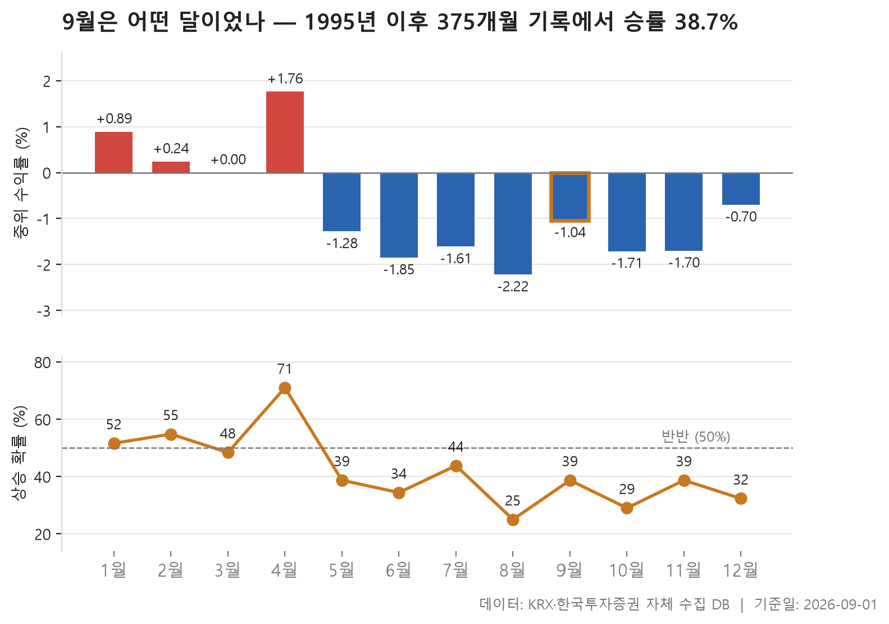

9월이 시작됐습니다. 달이 바뀔 때마다 "이 달은 원래 어땠나"를 한 번씩 확인해 보는 건 나쁘지 않은 습관인데, 문제는 그 '원래'라는 게 대개 인상에 기대어 만들어진다는 점입니다. 몇 해 전 크게 물렸던 기억 하나가 그 달 전체의 색을 정해 버리기도 하고요. 그래서 이번에는 인상 대신 기록을 꺼내 봤습니다. 1995년 6월부터 2026년 8월까지, 유효한 375개월치의 월별 기록을 열두 달로 나눠 늘어놓은 표입니다.

집계 방식은 단순합니다. 매월 마지막 거래일 종가를 기준으로 코스피와 코스닥 보통주 개별 종목의 한 달 수익률을 구하고, 그 한가운데 값을 그달의 대표값으로 삼았습니다. 지수가 아니라 종목들의 중간값이라는 점이 중요합니다. 덩치 큰 몇 종목이 지수를 끌어올린 달과, 대다수 종목이 함께 오른 달은 성격이 전혀 다른데 이 표는 후자 쪽을 본다고 생각하시면 됩니다. 그래서 지수 기준으로 기억하는 계절성과는 인상이 조금 다를 수 있습니다.

결론부터 말하면 9월은 31번의 관측에서 12번 올랐습니다. 승률로는 38.7%, 중위 수익률은 -1.04%. 열두 달을 중위 수익률 순으로 줄 세우면 위에서 6번째 자리입니다. 나쁜 달이라고 하기엔 애매하고 좋은 달이라고 하기엔 더 애매한, 딱 중간에 걸친 위치죠.

> 기준일: 2026-09-01 · 집계: 자체 수집 데이터베이스

## 9월은 31번 중 12번 올랐습니다 — 승률 38.7%, 중위 -1.04%

표를 위에서 아래로 훑으면 모양이 먼지 눈에 들어옵니다. 열두 달 중 한가운데 값이 플러스인 달은 세 개뿐이고, 나머지 여덟 달은 마이너스입니다. 3월은 0.00으로 정확히 경계에 걸촜 있죠. 열두 달의 중위 수익률을 다시 줄 세웠을 때 중간에 놓이는 값이 -1.16%라는 것도 같은 이야기입니다. 즉 이 데이터에서 '보통의 달'은 개별 종목 기준으로 소폭 마이너스입니다. 이건 시장이 늘 하락했다는 뜻이라기보다, 상장 종목 수가 많고 그중 절반 이상이 지지부진한 달이 흔했다는 쪽에 가깝습니다. 상승은 소수 종목에 몰리고 나머지는 조금씩 흘러내리는 그런 모양이요.

그 안에서 4월이 눈에 띄게 튑니다. 한가운데 값 1.76%에 승률 71.0%. 열두 달 중 승률이 절반을 넘는 건 1월(51.6%), 2월(54.8%), 그리고 4월뿐인데, 4월은 그 둘과도 거리가 꽤 벌어져 있습니다. 다만 4월이 항상 편하기만 했던 건 아닙니다. 최저 기록이 -20.30%로, 승률 높은 달에도 크게 리지는 해는 따로 있었다는 뜻입니다. 반대쪽 끝은 8월입니다. 중위 -2.22%로 가장 낮고, 승률도 25.0%로 넷 중 하나꼴. 그런데 8월은 최저가 -10.90%로 열두 달 중 낙폭이 가장 얕은 쪽에 속합니다. 자주 지지만 크게 지지는 않았던 달이었던 셈이죠. 여기서 10월은 정반대입니다. 승률은 29.0%에 그치는데 최고 14.85%와 최저 -31.63%가 한 칸에 나란히 있습니다. 진폭이 표에서 가장 큽니다. 이런 건 승률만 보고는 전혀 짐이 안 가는 대목입니다.

주인공인 9월로 돌아오면, 흥미로운 건 중간값과 평균이 벌어져 있다는 점입니다. 한가운데 값은 -1.04%인데 평균은 -2.77%. 평균이 1.73%p 아래에 놓여 있습니다. 이런 어긋남은 대체로 몇 번의 큰 하락이 평균만 유도록 끌어내릴 때 생깁니다. 실제로 9월의 최저 기록은 -17.69%, 최고는 12.96%로 아래쪽이 더 깊습니다. 달말마다 개별 종목의 가운듰 수익률을 츜다고 생각해 보면, 약 3년에 한 번은 싫은 9월이 똍을 수 있을 만큼의 승률입니다.

표에서 이런 구조가 가장 극단적인 달은 11월입니다. 중위는 -1.70%인데 평균은 -0.02%로, 이번엔 반대 방향으로 벌어져 있죠. 절반 넘는 종목이 내렸는데도 평균은 거의 제자리라는 건, 일부 큰 폭 상승이 평균을 위로 떠받쳤다는 뜻으로 읽을 수 있습니다. 7월도 결이 버슯합니다. 중위 -1.61%에 평균은 -0.48%로 짓있으니까요. 반면 5월과 6월은 중위와 평균이 나란히 마이너스로 내려가 있습니다. 틀어진 종목도 보통의 종목도 같이 안 좋았다는 이야기입니다. 이 둘 중 6월은 승률 34.4%로 표 전체에서도 아랫쪽에 속합니다.

그래서 승률과 중위값, 평균 셋을 같이 봐야 합니다. 9월과 5월, 11월은 승률이 38.7%로 똑같지만 성격은 제각각이에요. 5월은 가운듰과 평균이 함께 주저았고, 11월은 방금 본 대로 평균만 제자리로 돌아와 있으며, 9월은 평균이 더 깊이 내려가 있습니다. 같은 승률이라고 같은 달이 아닙니다. 그리고 이 모든 건 서른 번 남짓의 관측입니다. 한 해가 더해지고 빠지는 것만으로 순위가 흔들릴 수 있는 표본 크기니, 6번째라는 자리도 그렇게 단단한 숫자는 아니라고 보는 게 맞습니다.

| 월 | 관측연수(년) | 중위수익률(%) | 평균수익률(%) | 상승한해(년) | 승률(%) | 최고 | 최저 |
|---|---|---|---|---|---|---|---|
| 1월 | 31 | 0.89 | 1.97 | 16 | 51.60 | 31.15 | -10.99 |
| 2월 | 31 | 0.24 | 0.23 | 17 | 54.80 | 11.82 | -9.63 |
| 3월 | 31 | 0.00 | -0.22 | 15 | 48.40 | 12.08 | -16.87 |
| 4월 | 31 | 1.76 | 2.00 | 22 | 71.00 | 19.57 | -20.30 |
| 5월 | 31 | -1.28 | -2.09 | 12 | 38.70 | 10.51 | -18.98 |
| 6월 | 32 | -1.85 | -2.77 | 11 | 34.40 | 9.00 | -17.76 |
| 7월 | 32 | -1.61 | -0.48 | 14 | 43.80 | 9.91 | -12.65 |
| 8월 | 32 | -2.22 | -2.04 | 8 | 25.00 | 8.39 | -10.90 |
| 9월 | 31 | -1.04 | -2.77 | 12 | 38.70 | 12.96 | -17.69 |
| 10월 | 31 | -1.71 | -3.28 | 9 | 29.00 | 14.85 | -31.63 |
| 11월 | 31 | -1.70 | -0.02 | 12 | 38.70 | 17.05 | -12.82 |
| 12월 | 31 | -0.70 | -2.16 | 10 | 32.30 | 16.67 | -25.49 |

## 정리

정리하면 9월은 열두 달 중 여섯 번째, 눈에 띄게 좋지도 나쁘지도 않은 자리에 있습니다. 다만 한가운데 값과 평균이 벌어져 있어, 안 좋았던 해에는 꽤 깊게 내려간 적이 있다는 흔적이 남아 있습니다. 표가 말해 주는 건 여기까지고, 왜 그런 모양이 됐는지는 이 데이터로 설명할 수 없습니다.

한계도 분명합니다. 상장폐지된 종목은 종목 마스터에 남지 않아 집계에서 빠지기 때문에, 과거로 갈수록 살아남은 종목만 세게 됩니다. 그만큼 과거 수익률은 실제보다 높게 나올 수 있습니다. 집계 대상 종목 수 자체도 초기와 최근이 크게 다르고, 월 수익률은 절대값 100%에서 잘라 냈으며, 종목별로 수정주가 반영 여부가 달라 개별 수익률에는 오차가 섞여 있습니다. 중위값을 대표값으로 쓴 이유가 그것입니다. 계절성은 과거 기록의 모양일 뿐, 다음 한 달을 알려 주는 장치가 아니라는 점을 덧붙여 둡니다.

## 집계 기준

- **기준**: 매월 말 거래일 종가 기준, 전 종목 개별 수익률의 중위값
- **관측구간**: 1995-06 ~ 2026-08 (유효 375개월)
- **이번달**: 9월
- **이번달순위**: 6
- **모집단**: 종목 마스터에 등재된 KOSPI·KOSDAQ 보통주 (ETF·ETN·우선주 제외)
- **생존편향**: 상장폐지된 종목은 종목 마스터에 남지 않아 집계에서 빠집니다. 따라서 과거 수익률은 실제보다 높게 나올 수 있습니다. 집계 종목 수는 그달 거래된 전체 종목(ETF·우선주 포함) 대비 1995-06 360/955종목, 2026-08 2,527/4,277종목 입니다.
- **표본제외**: 집계 종목이 300개 미만인 0개월은 제외 (전체 376개월 중)
- **이상치처리**: 월 수익률은 절대값 100% 상한으로 절삭합니다(액면분할·병합 왜곡 완화). 버리지 않고 자르는 이유는, 버리면 하한이 -100%로 막힌 수익률 분포에서 급등만 사라져 통계가 아래로 치우치기 때문입니다.
- **주의**: 종가는 수정주가 여부가 종목별로 다를 수 있어 개별 종목 수익률에는 오차가 있을 수 있습니다. 중위값을 쓰는 이유입니다.

## 데이터 출처 및 유의사항

- **데이터출처**: 한국거래소(KRX) 공시 데이터와 한국투자증권 OpenAPI 를 직접 수집해 구축한 자체 데이터베이스
- **집계방식**: 수집·집계·차트 생성을 직접 구현한 파이프라인에서 자동 산출
- **갱신주기**: 이 페이지는 날짜별로 새 글을 쌓지 않고 **같은 주소를 갱신**합니다. 매월 첫 거래일에 그달을 기준으로 다시 작성하므로, 본문의 기준일이 곧 마지막으로 갱신된 날입니다.
- **작성고지**: 본문의 표·통계·차트는 자체 데이터베이스에서 계산된 값이며, 문장 작성 과정에 AI 도구를 활용했습니다.
- **면책**: 본 글은 정보 제공을 목적으로 하며 특정 종목의 매수·매도를 추천하지 않습니다. 제시된 수치는 과거 데이터이고 미래 수익을 보장하지 않습니다. 투자 판단과 그 결과에 대한 책임은 투자자 본인에게 있습니다.

