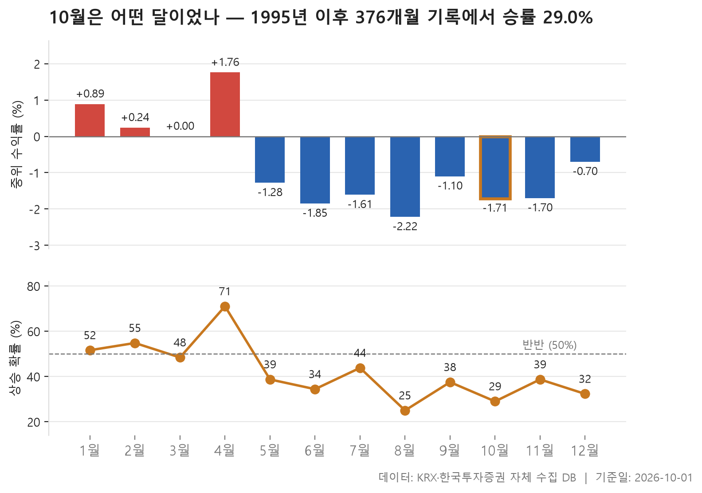

10월이 시작됐습니다. 오늘은 특정 종목이나 하루 시세 대신, 달력에서 10월이라는 자리가 과거에 어떤 모습이었는지 돌아봅니다. 자료는 1995년 6월부터 2026년 9월까지, 집계에 쓸 수 있었던 376개월의 기록입니다. 매달 마지막 거래일 종가로 상장 종목 하나하나의 한 달 수익률을 구하고, 그 값들을 줄 세웠을 때 한가운데 오는 값을 그달의 성적으로 삼았습니다. 지수 하나가 아니라 **'보통 종목은 그달에 어땠는가'**를 보는 방식이라고 생각하시면 됩니다.

결론부터 말하면 10월의 기록은 밝지 않습니다. 31번의 10월 가운데 오른 해는 9번으로, 비율은 29.0%입니다. 열 번 중 일곱 번가량은 보통 종목이 내린 채로 달을 마쳤다는 뜻입니다. 중위 수익률은 -1.71%이고, 열두 달을 이 값으로 줄 세우면 10번째에 놓입니다. 아래쪽인 것은 분명하지만 맨 아래는 아닙니다. 가장 약한 달은 8월(-2.22%), 가장 강한 달은 4월(+1.76%)입니다.

다만 이런 계절성 통계는 과거에 어떤 모양이 반복됐는지를 보여 줄 뿐이고, 올해 10월이 어떻게 흘러갈지는 알려 주지 않습니다. 아래에서는 표를 읽는 요령과 이 집계가 가진 한계를 함께 짚어 보겠습니다.

> 기준일: 2026-10-01 · 집계: 자체 수집 데이터베이스

## 10월은 31번 중 9번 올랐습니다 — 승률 29.0%, 중위 -1.71%

먼저 표 전체가 어떻게 생겼는지 봅니다. 열두 달 가운데 중위 수익률이 플러스인 달은 1월(+0.89%), 2월(+0.24%), 4월(+1.76%) 세 개뿐이고, 3월은 정확히 0.00%이며, 나머지 8개 달은 모두 마이너스입니다. 열두 달의 중위 수익률을 다시 늘어놓으면 한가운데 값이 -1.19%입니다. 이 표에서는 '보통의 달'이 원래 조금 내리는 달인 셈이죠. 그러니 10월을 평가할 때는 0과 비교하기보다 이 한가운데 값과 비교하는 편이 공정합니다. 그렇게 놓고 봐도 10월의 -1.71%는 평범한 달보다 한 단계 아래에 있습니다.

오른 해의 비율로 보면 10월은 더 두드러집니다. 29.0%는 8월의 25.0%에 이어 두 번째로 낮습니다. 흥미로운 대목은 6월입니다. 6월은 중위 수익률이 -1.85%로 10월보다 낮지만, 오른 해의 비율은 34.4%로 10월보다 높습니다. 한가운데 값의 순위와 오른 해의 비율이 꼭 같은 순서로 움직이지는 않는다는 이야기입니다. 10월은 두 기준 모두에서 아래쪽에 있어서, 어느 잣대로 봐도 약한 달로 분류되는 몇 안 되는 경우입니다.

표만 봐서는 놓치기 쉬운 부분이 평균입니다. 10월의 평균 수익률은 -3.28%로 열두 달 중 가장 낮고, 중위값 -1.71%보다 꽤 아래로 처져 있습니다. 평균이 중위값보다 크게 낮다는 것은 대다수의 10월보다 유난히 나빴던 몇 번의 10월이 평균을 끌어내렸다는 뜻입니다. 실제로 최저 기록 -31.63%는 표 전체에서 가장 깊습니다. 그다음으로 깊은 12월의 -25.49%와도 차이가 큽니다. 그렇다고 위쪽이 막혀 있었던 것도 아니어서 최고 기록은 +14.85%입니다. 10월은 보통은 조금 내리고, 가끔은 크게 무너졌으며, 드물게 크게 오르기도 한 달이었습니다. 위아래 폭이 넓은 달입니다.

다른 달과 비교하면 이 비대칭이 더 잘 보입니다. 11월은 중위 수익률이 -1.70%로 10월과 거의 같지만 평균은 -0.02%로 0에 가깝습니다. 7월도 중위 -1.61%에 평균 -0.48%로, 가끔 나온 강한 달이 평균을 위로 끌어올린 모양입니다. 1월 역시 평균 +1.97%가 중위 +0.89%보다 높고, 최고 기록은 +31.15%입니다. 10월은 그 반대 방향으로 치우쳐 있습니다. 표의 맨 위에 있는 4월은 31번 중 22번 올라 71.0%를 기록했고 평균도 +2.00%로 중위값과 크게 다르지 않습니다. 맨 아래의 8월은 32번 중 8번만 올랐습니다.

| 월 | 관측연수(년) | 중위수익률(%) | 평균수익률(%) | 상승한해(년) | 승률(%) | 최고 | 최저 |
|---|---|---|---|---|---|---|---|
| 1월 | 31 | +0.89 | +1.97 | 16 | 51.60 | +31.15 | -10.99 |
| 2월 | 31 | +0.24 | +0.23 | 17 | 54.80 | +11.82 | -9.63 |
| 3월 | 31 | 0.00 | -0.22 | 15 | 48.40 | +12.08 | -16.87 |
| 4월 | 31 | +1.76 | +2.00 | 22 | 71.00 | +19.57 | -20.30 |
| 5월 | 31 | -1.28 | -2.09 | 12 | 38.70 | +10.51 | -18.98 |
| 6월 | 32 | -1.85 | -2.77 | 11 | 34.40 | +9.00 | -17.76 |
| 7월 | 32 | -1.61 | -0.48 | 14 | 43.80 | +9.91 | -12.65 |
| 8월 | 32 | -2.22 | -2.04 | 8 | 25.00 | +8.39 | -10.90 |
| 9월 | 32 | -1.10 | -2.73 | 12 | 37.50 | +12.96 | -17.69 |
| 10월 | 31 | -1.71 | -3.28 | 9 | 29.00 | +14.85 | -31.63 |
| 11월 | 31 | -1.70 | -0.02 | 12 | 38.70 | +17.05 | -12.82 |
| 12월 | 31 | -0.70 | -2.16 | 10 | 32.30 | +16.67 | -25.49 |

## 정리

정리하면, 지난 기록 속 10월은 **오른 해가 셋 중 하나에도 못 미치고, 한가운데 값은 평범한 달보다 낮으며, 몇 번의 큰 하락이 평균을 더 끌어내린 달**이었습니다. 순위로는 10번째지만, 가장 깊었던 하락까지 따지면 표에서 꼬리 위험이 가장 두드러진 달이라고 볼 수 있습니다.

한계도 분명히 해 둡니다. 상장폐지된 종목은 집계에서 빠지기 때문에 과거 수익률이 실제보다 좋게 나왔을 수 있고, 종목마다 수정주가 반영 여부가 달라 개별 수익률에는 오차가 섞여 있습니다. 무엇보다 달마다 관측이 31번이나 32번뿐이라 몇 해의 극단적인 결과만으로도 순위가 쉽게 바뀝니다. 이 표는 10월이 과거에 어떤 모습이었는지를 보여 줄 뿐, 올해 10월의 방향을 알려 주는 근거로 쓰기는 어렵습니다.

## 집계 기준

- **기준**: 매월 말 거래일 종가 기준, 전 종목 개별 수익률의 중위값
- **관측구간**: 1995-06 ~ 2026-09 (유효 376개월)
- **이번달**: 10월
- **이번달순위**: 10
- **모집단**: 종목 마스터에 등재된 KOSPI·KOSDAQ 보통주 (ETF·ETN·우선주 제외)
- **생존편향**: 상장폐지된 종목은 종목 마스터에 남지 않아 집계에서 빠집니다. 따라서 과거 수익률은 실제보다 높게 나올 수 있습니다. 집계 종목 수는 그달 거래된 전체 종목(ETF·우선주 포함) 대비 1995-06 360/955종목, 2026-09 2,527/4,044종목 입니다.
- **표본제외**: 집계 종목이 300개 미만인 0개월은 제외 (전체 377개월 중)
- **이상치처리**: 월 수익률은 절대값 100% 상한으로 절삭합니다(액면분할·병합 왜곡 완화). 버리지 않고 자르는 이유는, 버리면 하한이 -100%로 막힌 수익률 분포에서 급등만 사라져 통계가 아래로 치우치기 때문입니다.
- **주의**: 종가는 수정주가 여부가 종목별로 다를 수 있어 개별 종목 수익률에는 오차가 있을 수 있습니다. 중위값을 쓰는 이유입니다.

## 데이터 출처 및 유의사항

- **데이터출처**: 한국거래소(KRX) 공시 데이터와 한국투자증권 OpenAPI 를 직접 수집해 구축한 자체 데이터베이스
- **집계방식**: 수집·집계·차트 생성을 직접 구현한 파이프라인에서 자동 산출
- **작성고지**: 본문의 표·통계·차트는 자체 데이터베이스에서 계산된 값이며, 문장 작성 과정에 AI 도구를 활용했습니다.
- **면책**: 본 글은 정보 제공을 목적으로 하며 특정 종목의 매수·매도를 추천하지 않습니다. 제시된 수치는 과거 데이터이고 미래 수익을 보장하지 않습니다. 투자 판단과 그 결과에 대한 책임은 투자자 본인에게 있습니다.
- **갱신주기**: 이 페이지는 날짜별로 새 글을 쌓지 않고 **같은 주소를 갱신**합니다. 매월 첫 거래일에 그달을 기준으로 다시 작성하므로, 본문의 기준일이 곧 마지막으로 갱신된 날입니다.

